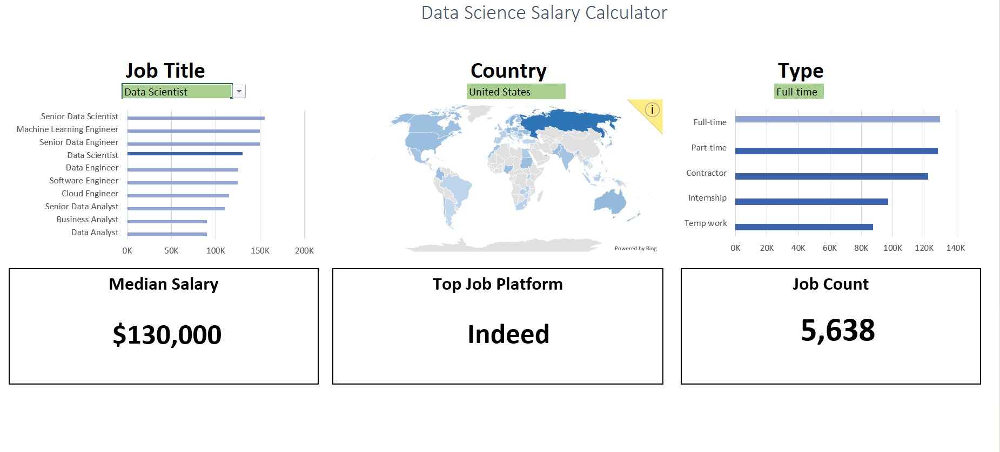

# Data-Analytics-Salary-Dashboard (Excel)
Interactive Excel dashboard analyzing salary trends across data-related roles, locations, and employment types.

## Dashboard Preview

## Project Overview

This project analyzes 2023 data-science job market data using Microsoft Excel.

The dashboard was designed to help users explore how salaries and job opportunities vary across job titles, countries, and employment types. Interactive slicers allow users to dynamically filter the dashboard and compare different segments of the job market.

## My Process

- Cleaned and validated the dataset and prepared fields for analysis
- Structured the data for PivotTable analysis
- Used Excel formulas and functions to calculate and validate key metrics
- Built PivotTables and PivotCharts to summarize salary and job-market patterns
- Compared results across job titles, countries, and employment types
- Designed an interactive dashboard using slicers for dynamic filtering
- Reviewed the results and summarized key findings from the analysed data

## Dashboard Features

- Salary comparison across data-related job roles
- Median salary KPI
- Job count KPI
- Country-level salary analysis
- Employment-type comparison
- Job-platform analysis
- Interactive slicers for Job Title, Country, and Employment Type

## Key Insights

- Salary levels vary considerably across different data-related roles
- Senior and specialized roles generally show higher salary levels than entry-level roles
- Full-time employment represents a large proportion of the job records in the analysed dataset
- Salary patterns vary across countries and locations
- Job-platform usage and job availability vary depending on the selected role, location, and employment type

## Tools & Skills Used

- Microsoft Excel
- PivotTables
- PivotCharts
- Interactive Slicers
- VLOOKUP
- MEDIAN
- COUNTIF / COUNTIFS
- IF / IFS
- Data Cleaning
- Data Validation
- Data Transformation
- Dashboard Design
- Data Analysis
- Business Insight Generation

## Dataset

The project uses 2023 data-science job market data containing information such as:

- Job titles
- Salaries
- Countries and locations
- Employment types
- Job platforms
- Skills and other job-related attributes

The dataset was cleaned and structured in Excel before being used for analysis and dashboard development.

## Conclusion

This project demonstrates the use of Excel to clean, analyze, and visualize job-market data through an interactive dashboard.

The final dashboard enables users to explore salary and employment patterns across different roles, locations, and employment types while demonstrating practical Excel skills in data preparation, analysis, and visualization.
